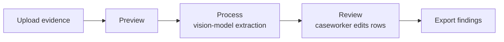
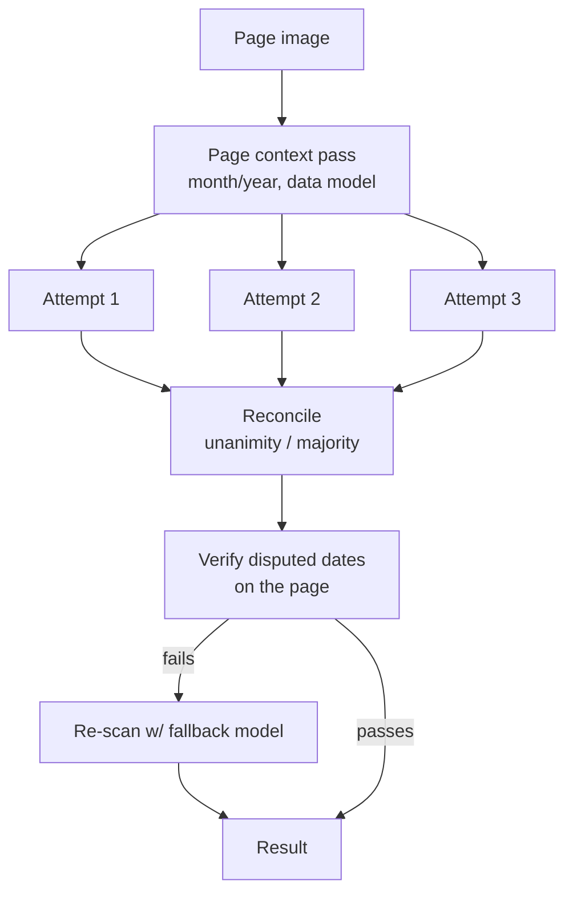
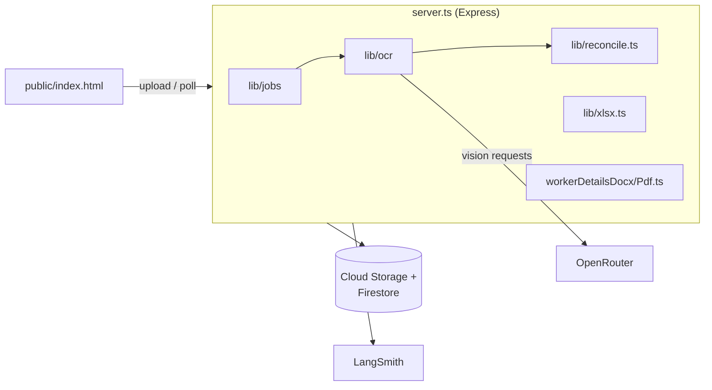

# TWC2 Salary Claim Calculator

An internal tool for [TWC2](https://twc2.org.sg) (Transient Workers Count Too), a Singapore
nonprofit that helps migrant workers recover wages they're legally owed but weren't paid. It
turns a caseworker's raw evidence — timesheets, an IPA (In-Principle Approval) letter, bank
statements, medical bills — into a filled salary-calculation spreadsheet and a printable claim
breakdown, without hand-transcribing every timesheet row first.

## The problem

Wage-claim evidence is almost always messy: handwritten paper timesheets in mixed languages,
photographed at odd angles, spanning many months. Figuring out what's owed means applying the
Employment Act 1968's overtime/rest-day/public-holiday rules to every date — previously done by
hand-copying each page into a spreadsheet, which doesn't scale and is itself error-prone. This
tool automates the reading/extraction while keeping a human reviewing every result before it's
used — it assists a claim, it doesn't decide one.

## How it works

1. **Upload** — timesheets + IPA letter (required), bank statements + medical bills (optional).
2. **Preview** — thumbnails for rotation/page-exclusion checks before the real scan runs.
3. **Process** — a vision model reads each page; timesheet pages are scanned 3x independently and
   cross-checked before being trusted (see below).
4. **Review** — results stream in page-by-page; caseworker edits any row. Edited pages are
   auto-saved as raw-vs-corrected pairs for future model tuning ([Feedback loop](#feedback-loop)).
5. **Export** — reviewed rows fill `calculation.xltx`; a Worker Personal Details breakdown exports
   as DOCX/PDF.



## How extraction works



Three independently-seeded attempts per timesheet page (`lib/reconcile.ts`) mean a systematic
model bias — e.g. repeating a previous row's value on a dense table — shows up as disagreement
instead of being silently reproduced. IPA extraction (one printed document, not a handwritten
table) skips this and runs a single deterministic pass. Timesheet batches run as background jobs
(`lib/jobs/`) since real scans take 15–20+ minutes — the browser polls and renders each page as
it finishes.

## Employment Act rules

`docs/employment-act-1968-rules.md` and `docs/singapore-public-holidays-2025-2026.md` are
reference material on the Act's overtime/rest-day/public-holiday pay rules and gazetted holiday
dates. Not yet wired into automatic dollar calculations — tracked as future work.

## Feedback loop

Any page a caseworker edits gets auto-saved (image + raw model reading + corrected version) to
Cloud Storage/Firestore (`lib/feedback.ts`) — no manual flagging needed. Best-effort; a storage
failure here never blocks the caseworker's actual work. Builds a ground-truth corpus for future
prompt/model tuning.

## Models used

All extraction goes through `sendVisionRequest` (`lib/ocr/visionClient.ts`), calling
**`xiaomi/mimo-v2.5`** via [OpenRouter](https://openrouter.ai) — chosen over
`qwen3-vl-32b-instruct` and `gemini-2.5-flash` on the hardest real cases, at roughly half
`gemini-2.5-flash`'s cost. A separate `FALLBACK_VISION_MODEL` constant exists for
date-verification escalation but currently points at the same model (no-op until repointed).
Calls are traced via [LangSmith](https://smith.langchain.com) when configured.

## Architecture



Sits behind an SSO gate keyed off `camans.twc2.org.sg`'s login (shared JWT cookie on
`.twc2.org.sg`) — a caseworker signed into the main case-management system doesn't need to log in
again here. See top of `server.ts`.

## Getting started

```bash
npm install
npm run server   # loads .env, runs on :3002 by default
```

| Variable | Required | Purpose |
|---|---|---|
| `OPENROUTER_API_KEY` | yes | Vision model calls |
| `JWT_ACCESS_TOKEN_SECRET` | yes | Verifying the shared SSO cookie |
| `LANGSMITH_API_KEY`/`_TRACING`/`_ENDPOINT`/`_PROJECT` | no | Tracing |
| `FLAGGED_PAGES_BUCKET` | no | Feedback-loop bucket (default `twc2-ai-flagged-pages`) |
| `DISABLE_SSO` | no | `true` skips the SSO gate locally (non-production only) |
| `PORT` | no | Defaults to `3002` |

GCS/Firestore credentials come from the Cloud Run service account in production, or
`gcloud auth application-default login` locally.
